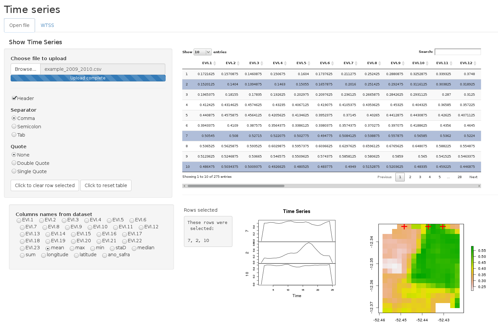
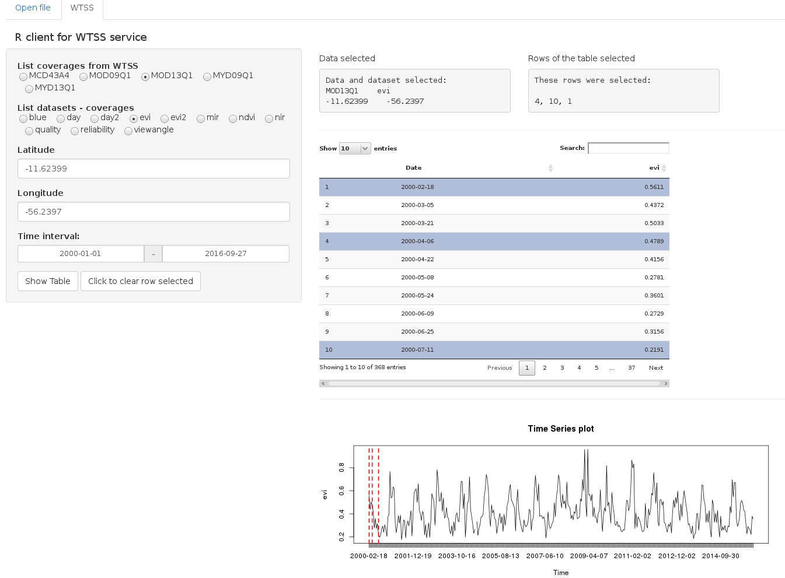

# Shiny Time Series
 
This application is based on shiny, an interactive web applications with R, which allows to see time series in an environment web.

## Usage

- Open RStudio

- Install devtools <code>install.packages("devtools")</code>
 
- Load devtools <code>library(devtools)</code>

- Install the wtss.R package <code>install_github("e-sensing/wtss.R")</code>

- Load the wtss.R package <code>library(wtss.R)</code>

- If you not have installed svn ("subversion") yet, open terminal and install it <code>sudo apt-get install subversion</code>.

- Download the folder of github project <code>svn export https://github.com/ammaciel/Shiny/trunk/data</code>

- Load devtools <code>library(shiny)</code>

- Launch the app by running <code>runApp("~/data/wtss")</code>. Directory which contains the scripts.

- In a web application, load file "example_2009_2010.csv" from directory ~/data

## Web Application

Fig. 1. Open a file in the format .csv and view raster with parts of the time series 

Fig. 2. View of a time series from WTSS

